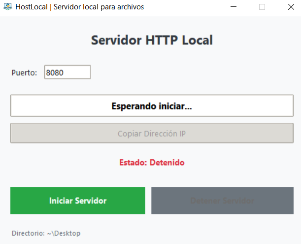

# hostlocal | Servidor Local Rapido


hostlocal permite levantar un servidor HTTP de forma instantanea en cualquier directorio de tu ordenador, proporcionando una interfaz sencilla para gestionar el puerto y la visibilidad del servidor.

## Vista Previa



## Caracteristicas Principales

- **Servidor Instantaneo:** Inicia un servidor HTTP en el directorio actual con un clic.
- **Configuracion de Puerto:** Permite definir puertos personalizados para evitar conflictos.
- **Interfaz Intuitiva:** Botones de encendido/apagado e indicadores de estado.
- **Acceso Directo:** Abre automaticamente la URL del servidor en tu navegador predeterminado.

## Requisitos

- Python 3.8 o superior.

## Instalacion

1. Clona el repositorio o descarga los archivos.
2. Abre una terminal en la carpeta del proyecto.
3. Ejecuta directamente (utiliza librerias de la libreria estandar).

## Uso

1. Ejecuta la aplicacion:
   ```bash
   python main.py
   ```
2. Selecciona el directorio que deseas servir (por defecto el actual).
3. Haz clic en "Iniciar Servidor".
4. Accede a los archivos desde tu navegador en `http://localhost:[puerto]`.

## Estructura del Proyecto

```text
Server/
├── main.py                    # Script de inicio y configuracion de ventana
├── requirements.txt           # Informativo
├── assets/                    # Iconos y logos
├── src/                       # Codigo fuente
│   ├── gui/                   # Pantalla principal del servidor
│   └── utils/                 # Utilidades de sistema
```

## Tecnologias Utilizadas

- [Python](https://www.python.org/)
- [Tkinter](https://docs.python.org/3/library/tkinter.html) - GUI
- [http.server](https://docs.python.org/3/library/http.server.html) - Modulo de servidor nativo

## Licencia

Este proyecto es de uso libre para propositos educativos y personales.

## Autor

- **Ricardo** - [GitHub](https://github.com/[tu-usuario])
